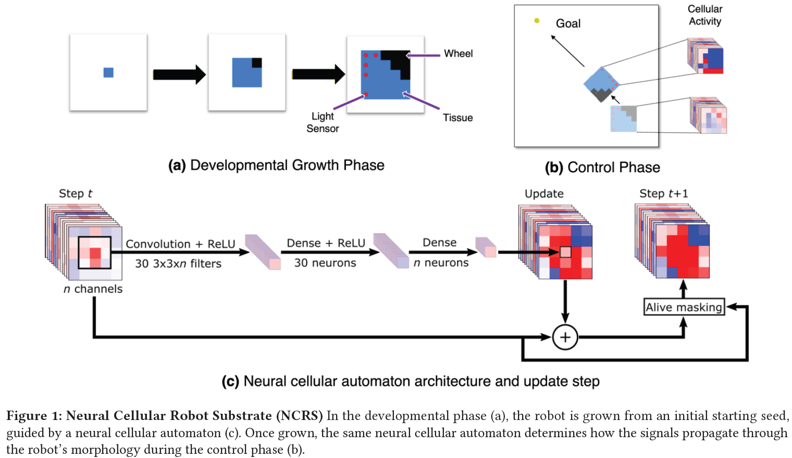

# neural-cellular-robot-substrate
Neural cellular automaton for developing body and brain of a modular robot



Code and videos for the paper: [arXiv Preprint](https://arxiv.org/abs/2203.12066)

Dependencies used:
* Python 3.8.10
* TensorFlow 2.6
* gym 0.21.0
* pygame 2.0.1
* box2d-py 2.3.5
* cma 3.1.0
* numpy 1.19.5
* moviepy 3.1.1
* imageio 2.9.0

## Folder: src

Playing light chasing task:
```
python modular_light_chaser.py
```

Playing carrying ball to target:
```
python modular_carrier.py
```

Train light chasing task with CMA-ES:
```
python train_modular_light_chaser_es.py
```

Train light chasing with obstacle task with CMA-ES:
```
python train_modular_light_chaser_es.py --wall
```

Train carrying ball to target task with CMA-ES:
```
python train_modular_carrier_es.py
```

Display training options using `python train_modular_light_chaser_es.py --help`:
```
usage: train_modular_light_chaser_es.py [-h] [--maxgen MAXGEN] [--popsize POPSIZE] [--threads THREADS] [--width WIDTH] [--height HEIGHT] [--stdinit STDINIT] [--bodytype BODYTYPE] [--retrain RETRAIN] [--saveall] [--wall]

optional arguments:
  -h, --help           show this help message and exit
  --maxgen MAXGEN      Maximum number of generations
  --popsize POPSIZE    Population size
  --threads THREADS    Number of threads
  --width WIDTH        CA width
  --height HEIGHT      CA height
  --stdinit STDINIT    Standard deviation to initialize the Evolution Strategy
  --bodytype BODYTYPE  Premade body types: {1,2,3}
  --retrain RETRAIN    path to log directory for retraining
  --saveall            Save all solutions
  --wall               Wall environment
```

Test trained NCA:
```
python test_modular_*.py --logdir <path>
```

Generate test video of trained NCA:
```
python test_video_modular_*.py --logdir <path>
```

## Folder: videos

This folder contains sample videos of the trained models reported in the paper.

## Citation
```
@inproceedings{pontes2022unified,
  title={A Unified Substrate for Body-Brain Co-evolution},
  author={Pontes-Filho, Sidney and Walker, Kathryn and Najarro, Elias and Nichele, Stefano and Risi, Sebastian},
  booktitle={From Cells to Societies: Collective Learning across Scales},
  year={2022}
}
```